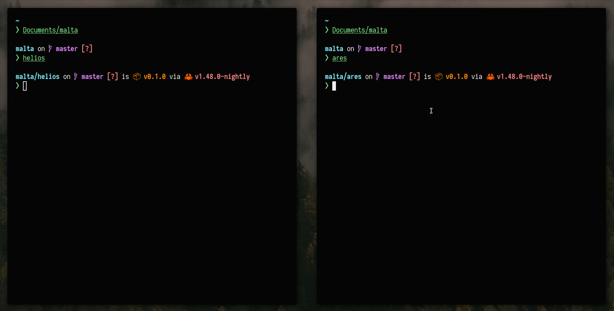

<p align="center">
  
</p>

<p align="center">
  
  
  
  
  
  
  <br />
</p>

<hr>

## ✨ Binaries

```sh
git clone https://github.com/safinsingh/malta.git
make release
```

## 🔮 In action



## 🔎 How it works

- `helios` is `malta`'s client engine, it finds and scores vulnerabilities specified in a configuration file (see the example helios/conf.yaml).
- After capturing the secret keys generated by `helios gen-keys`, insert them into `{helios/ares}/src/crypto.rs` in order to encrypt/decrypt your configuration. After writing your configuration, you'll need to re-build the binaries with `cargo build --release`.
- Notice that in the configuration, you'll need to specify the URL of a Firebase Realtime Database URL. This is where all scoring data will be appended.
- Once built, you can run `helios encrypt` to encrypt your configuration. You can now safely delete your `config.yaml` and place the encrypted `conf.z` on both your server and client.
- Now, start `ares` and distribute the scoring engine. Typically, this is done via the distribution of an insecure virtual machine with vulnerabilities preloaded.

## 👨‍💻 Author

Linkedin: [Safin Singh](https://www.linkedin.com/in/safin-singh-b2630918a/) <br>
GitHub: [safinsingh](https://github.com/safinsingh) <br>
Dribbble: [Safin Singh](https://dribbble.com/safinsingh/) <br>
YouTube: [Safin Singh](https://www.youtube.com/channel/UCvb01sUdAgcPAG1j0SLxAtA)

## 🤝 Contributing

Contributions, PRs, issues and feature requests are welcome! Feel free to check out my [issues page](https://github.com/safinsingh/midnight/issues).

## ❤️ Show your support

Give a ⭐️ if this project helped you!
Hope you enjoy it!
